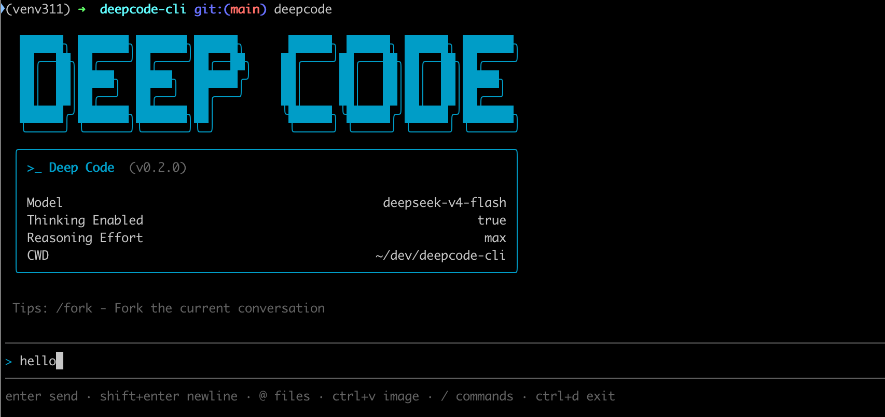

<div align="center">
<br/>
<br/>
<p align="center">
  <a href='https://deepcode.vegamo.cn/'>
    
  </a>
</p>
<h1>Deep Code CLI</h1>

[![][npm-release-shield]][npm-release-link] [![][npm-downloads-shield]][npm-downloads-link] [![][github-contributors-shield]][github-contributors-link] [![][github-forks-shield]][github-forks-link] [![][github-stars-shield]][github-stars-link]
[![][github-issues-shield]][github-issues-link] [![][github-issues-pr-shield]][github-issues-pr-link] [![][github-license-shield]][github-license-link]

[English](README-en.md) · 中文

<br/>
</div>

[Deep Code](https://github.com/lessweb/deepcode-cli) 是专为 `deepseek-v4` 模型优化的终端 AI 编码助手，支持深度思考、推理强度控制、Agent Skills 以及 MCP 集成。

## 安装

```bash
npm install -g @vegamo/deepcode-cli
```

在任意项目目录下运行 `deepcode` 即可启动。



## 配置

创建 `~/.deepcode/settings.json` 文件，内容如下：

```json
{
  "env": {
    "MODEL": "deepseek-v4-pro",
    "BASE_URL": "https://api.deepseek.com",
    "API_KEY": "sk-..."
  },
  "thinkingEnabled": true,
  "reasoningEffort": "max"
}
```

配置文件与 [Deep Code VSCode 插件](https://github.com/lessweb/deepcode-cli) 共享，无需重复配置。

完整配置说明（多层级优先级、环境变量等）请参阅 [docs/configuration.md](docs/configuration.md)。

## 主要功能

### **Skills**
Deep Code CLI 支持 agent skills，允许您扩展助手的能力：

Skills 会按以下优先级扫描：

| Scope   | Path                  | Purpose                       |
| :------ | :-------------------- | :---------------------------- |
| Project | `./.deepcode/skills/` | Deep Code 原生位置            |
| Project | `./.agents/skills/`   | 跨客户端互操作                |
| User    | `~/.deepcode/skills/` | Deep Code 原生位置            |
| User    | `~/.agents/skills/`   | 跨客户端互操作                |

### **为 DeepSeek 优化**
- 专门为 DeepSeek 模型性能调优。
- 通过使用[上下文缓存](https://api-docs.deepseek.com/guides/kv_cache)来降低成本。
- 原生支持[思考模式](https://api-docs.deepseek.com/guides/thinking_mode)和思考强度控制。

## Team 多角色协作

Deep Code CLI 内置 Team 模块，提供基于多角色智能体的协作能力，支持 Ralph 风格的 autonomous 自主编排模式（plan → dev → verify → fix 循环直到完成）。

### 目录命名差异说明

Deep Code 存在两套并存的目录命名约定，请勿混淆：

| 目录              | 用途                                         | 说明                          |
| :---------------- | :------------------------------------------- | :---------------------------- |
| `~/.deepcode/`    | 用户级 `settings.json`、`skills/`、`plugins/` 等 | Deep Code 主配置目录（无 x）   |
| `./.deepcode/`    | 项目级 `settings.json`、`skills/`、`plugins/` 等 | Deep Code 主配置目录（无 x）   |
| `./.deepcodex/`   | 项目级 `autonomous.yml`、`runs/`、`notes.md`  | Team autonomous 专用目录（带 x） |
| `~/.deepcodex/`   | 用户级 `autonomous.yml`                       | Team autonomous 专用目录（带 x） |

- **`.deepcode/`**（无 x）：Deep Code CLI 主配置目录，存放 `settings.json`、`skills/`、`plugins/` 等
- **`.deepcodex/`**（带 x）：Team 模块 autonomous 编排目录，存放 `autonomous.yml`、`runs/`、`notes.md`

### Autonomous 自主编排模式

通过 `deepcode team autonomous` 启动 Ralph 风格 4 阶段循环：

```bash
deepcode team autonomous --goal "实现登录功能" --max-iterations 10
```

**autonomous 4 阶段流程**（plan → dev → verify → fix 循环直到完成）：

| 阶段    | 说明                                    |
| :------ | :-------------------------------------- |
| Plan    | 规划阶段：根据 goal 拆解任务，生成实施计划       |
| Dev     | 开发阶段：按计划执行实施，调用 LLM 完成代码变更   |
| Verify  | 验证阶段：运行测试或检查点，确认实施成果         |
| Fix     | 修复阶段：根据验证结果修复问题，进入下一轮迭代     |

**Stage 标题命名约定**：

LLM 在每个阶段输出时使用以下标题前缀（作为 stage 识别契约，stage-handlers.ts 基于该前缀推断当前阶段）：

- `# Plan 阶段` — Plan 阶段输出标题
- `# Dev 阶段` — Dev 阶段输出标题
- `# Verify 阶段` — Verify 阶段输出标题
- `# Fix 阶段` — Fix 阶段输出标题

### Autonomous 配置

在项目根目录创建 `./.deepcodex/autonomous.yml`：

```yaml
max_iterations: 10
confirmation: smart        # auto-approve | ask-user | fail-closed
sleep_guard: true
git:
  auto_commit: true
  branch_prefix: "autonomous/"
```

运行状态持久化路径：

- `./.deepcodex/runs/<runId>/state.json` — 单次运行状态
- `./.deepcodex/notes.md` — 项目级跨轮记忆（多个 run 共享）

支持通过 `--resume-run` 断点续跑（布尔开关，自动恢复最近一次可恢复的 run）。

## DeepCodeX 新特性总览

DeepCodeX 在 Deep Code CLI 基础上完成了**多角色融合**与**企业级应用生成能力（EAG）**两大跃迁，并补充了动态指令注入、AskUserQuestion 自动衔接、V2 上下文记忆、Loop-Graph 融合编排等多项新特性。

完整文档：[docs/new-features.md](docs/new-features.md) ｜ [English](docs/new-features_en.md)

| 能力域 | 关键能力 | 主要入口 |
|--------|---------|---------|
| **A. 多角色协作** | 5 核心角色 + 30 领域专家 + 智能匹配 + 八阶段流程 | `/team` |
| **B. 自主编排** | Ralph 4 阶段循环 + Cybernetics 控制论 + 6 大工作流模式 | `/team autonomous` |
| **C. EAG 企业级应用生成** | 三 Loop 设计/编码/测试 + 红线评估 + 范式唤起 + 无人值守 | `/eag-autonomous` |
| **D. Loop-Graph 融合** | DAG 拓扑编排 + 节点内 Loop + 谓词路由 + 图级护栏 | `/eag-graph` |
| **E. V2 上下文记忆** | 双层上下文 + 滑动窗口 + Diff 预览 + 双轴审批 + 经验 RAG | 自动启用 |
| **F. 动态中断与后台任务** | InterruptQueue + 后台子 Agent + 任务状态机 | `/inject` `/bg` `/tasks` |
| **G. AskUserQuestion 自动衔接** | 三层白名单 + suggestedCommand + 自动命令执行 | 由 LLM 触发 |
| **H. Builtin Skills 增强** | 4 bundled + 3 默认 + 4 文档处理 skills（docx/pdf/pptx/xlsx） | `/skills` |
| **I. 日志与可观测性** | 日志轮转（10MB/3 备份）+ 错误类型保留 + 中断事件日志 | 自动启用 |
| **J. 多模型 Provider** | Anthropic 原生 + OpenAI 兼容 + Qwen3 推理模型兼容 | `settings.json` |

**核心设计原则**：[Karpathy 四大原则](docs/fusion/KARPATHY_PRINCIPLES.md) + [Ponytail 决策梯](docs/fusion/PONYTAIL_RULES.md)（`docs/fusion/` 为本地设计文档，未入库）

## 斜杠命令与按键功能

| 斜杠命令        | 操作                               |
|-------------|----------------------------------|
| `/`         | 打开 skills / 命令菜单                 |
| `/help`     | 列出全部内置命令及说明                     |
| `/new`      | 开始新对话                            |
| `/resume`   | 选择历史对话继续                         |
| `/fork`     | 从当前对话创建独立的新会话                    |
| `/continue` | 继续当前对话，或选择历史对话恢复                 |
| `/model`    | 切换模型、思考模式和推理强度                   |
| `/raw`      | 切换显示模式（Normal / Lite / Raw 滚动回溯） |
| `/init`     | 初始化 AGENTS.md 文件                 |
| `/skills`   | 列出可用 skills                      |
| `/mcp`      | 查看 MCP 服务器状态和可用工具                |
| `/undo`     | 将代码和/或对话恢复到之前的状态                 |
| `/exit`     | 退出（也可用连续 `Ctrl+D`）               |
| `/team`     | 多角色团队调度（自动匹配最合适角色） |
| `/architect` `/pm` `/coder` `/tester` `/ui` | 强制分派到指定角色（架构师/产品经理/独立开发者/测试专家/UI 设计师） |
| `/memory`   | 记忆管理（list / delete / review / export） |
| `/rules`    | RLIS 规则管理（list / add / remove / show / path） |
| `/quality-check` | 质量门禁（codemap / uiux / visual / all） |
| `/review`   | 代码审查（typecheck / lint / format / full，或直接跟自然语言任务） |
| `/eag-autonomous` | 启动 EAG 无人值守循环（plan→dev→verify→fix） |
| `/eag-autonomous-status` | 查询 EAG 自主运行状态（位置参数 `<runId>`，省略取最近 run） |
| `/eag-autonomous-stop` | 熔断中止 EAG 自主运行（位置参数 `<runId>`，省略取最近 run） |
| `/eag-graph` | 启动 Loop-Graph 图编排执行（DAG 拓扑 + 谓词路由） |
| `/inject`   | 向当前任务追加指令（动态中断）               |
| `/bg`       | 后台启动子 Agent（独立 SessionManager） |
| `/tasks`    | 列出所有任务（含后台子 Agent）             |
| `/fg`       | 切换前台关注的任务                      |
| `/cancel`   | 取消指定任务                          |
| `/pause`    | 暂停当前前台任务                         |
| `/resume <taskId>` | 恢复暂停的后台任务（注意：无参数的 `/resume` 仍表示恢复历史对话） |
| `/plan`     | 进入规划模式（仅生成实施计划，不执行代码变更）       |

> Team 模块同时提供 CLI 子命令：`deepcode team list / match / dispatch / autonomous / full-lifecycle`（共识评审通过 `deepcode team dispatch --consensus` 启用）。

| 按键            | 操作                 |
|---------------|--------------------|
| `Enter`       | 发送消息               |
| `Shift+Enter` | 插入换行（也可用 `Ctrl+J`） |
| `Ctrl+V`      | 从剪贴板粘贴图片           |
| `Esc`         | 中断当前模型回复           |
| 连续 `Ctrl+D`   | 退出                 |

## 支持的模型

- `deepseek-v4-pro`（推荐使用）
- `deepseek-v4-flash`
- 任何其他 OpenAI 兼容模型

## 架构和基准测试

Armin Ronacher 在[《Better Models: Worse Tools》](https://lucumr.pocoo.org/2026/7/4/better-models-worse-tools/)中指出，工具 schema 不是「中立的」：模型（LLM）会继承训练和强化学习中形成的工具使用习惯，因此可能在某个主流 harness 中表现很好，却在另一套工具形态下变得不稳定。这正是 Deep Code 的架构出发点：只为 DeepSeek 量身调优，从而让 harness 本身持续贴合 DeepSeek 的行为特点。

Deep Code 的收益来自于工具约束、上下文管理、Agent Skills 和权限策略等多项设计叠加后的结果。[deepcode-qrcode-benchmark](https://github.com/qorzj/deepcode-qrcode-benchmark) 项目展示了在一个真实且有难度的 Python 需求上，Deep Code + DeepSeek + `/plan` 模式相较 Claude Code + DeepSeek 的组合具有效果优势。

> 详见：[Deep Code 架构](docs/architecture.md)

## 常见问题

### Deep Code 是否有 VSCode 插件？

有的。Deep Code 提供功能完整的 VSCode 插件，可在 [VSCode Marketplace](https://marketplace.visualstudio.com/items?itemName=vegamo.deepcode-vscode) 安装。插件与 CLI 共享 `~/.deepcode/settings.json` 配置文件，可以在终端和编辑器之间无缝切换。

### Deep Code 是否支持理解图片？

Deep Code 内置免费可用的图片理解工具，可使用ctrl+v从剪贴板粘贴图片。Deep Code 本身支持多模态，但目前 deepseek-v4 系列模型还不支持多模态。有些模型虽然有多模态能力，但对多轮对话请求的限制太严。目前多模态输入推荐使用火山方舟的 Doubao-Seed-2.0-pro 模型，适配效果最好。

### 怎样在任务完成后自动给 Slack 发消息？

编写一个调用 Slack webhook 的 Shell 通知脚本，然后在 `~/.deepcode/settings.json` 中将 `notify` 字段设为该脚本的完整路径即可。详细步骤请参考 [docs/notify.md](docs/notify.md)。

### 怎样启用联网搜索功能？

Deep Code 已支持 [DeepSeek Responses API](https://api-docs.deepseek.com/zh-cn/guides/responses_api/#tools) 的原生联网搜索能力。如果你希望使用自定义脚本进行联网搜索，可以在 `~/.deepcode/settings.json` 中将 `webSearchTool` 设为脚本的完整路径即可。详细步骤可参考：https://github.com/qorzj/web_search_cli

### 如何配置 MCP？

Deep Code 支持 MCP（Model Context Protocol），可以连接 GitHub、浏览器、数据库等外部服务。在 `settings.json` 中配置 `mcpServers` 字段即可启用，启动后使用 `/mcp` 命令查看已配置的 MCP 服务器状态和可用工具。

详细配置指南：[docs/mcp.md](docs/mcp.md)

### 如何配置 Deep Code 任务完成后发送通知？

当 AI 助手完成一轮任务后，Deep Code 可以自动执行一个通知脚本，将任务结果发送到你指定的渠道（如 Slack、系统通知等）。

详细配置指南：[docs/notify.md](docs/notify.md)

### Deep Code 只支持 YOLO 模式吗？

不是。Deep Code 内置了细粒度的权限控制机制，支持在 AI 助手执行 Shell 命令、读写文件、访问网络等操作前进行确认。你可以通过 `settings.json` 中的 `permissions` 字段按需配置每种权限范围的策略：始终允许、始终询问、或直接拒绝。详见 [docs/permission.md](docs/permission.md)。

### 是否支持 Coding Plan？

支持。只要把 `~/.deepcode/settings.json` 的 `env.BASE_URL` 配置为 OpenAI 兼容的接口地址就行。以火山方舟的 Coding Plan 为例：

```json
{
  "env": {
    "MODEL": "ark-code-latest",
    "BASE_URL": "https://ark.cn-beijing.volces.com/api/coding/v3",
    "API_KEY": "**************"
  },
  "thinkingEnabled": true
}
```

## 贡献

欢迎贡献代码！以下是参与方式：

```bash
# 克隆仓库
git clone https://github.com/lessweb/deepcode-cli.git
cd deepcode-cli

# 安装依赖
npm install

# 运行测试
npm test

# CLI本地开发（类型检查 + lint + 格式检查 + 构建）
npm run build

# CLI链接到全局（即本地全局安装）
npm link

# VSCode插件本地开发
npm run build:vscode

```

- 提交 PR 前请确保 `npm run check` 通过（类型检查 + lint + 格式检查）
- 建议在执行构建前，先执行 `npm run format` 自动格式化代码，避免构建报错

## 获取帮助

- 在 GitHub Issues 上报告错误或请求功能 (https://github.com/lessweb/deepcode-cli/issues)

## 协议

- MIT

## 支持我们

如果你觉得这个工具对你有帮助，请考虑通过以下方式支持我们：

- 在 GitHub 上给我们一个 Star (https://github.com/lessweb/deepcode-cli)
- 向我们提交反馈和建议
- 分享给你的朋友和同事

<!-- LINK GROUP -->

[npm-release-link]: https://www.npmjs.com/package/@vegamo/deepcode-cli
[npm-release-shield]: https://img.shields.io/npm/v/@vegamo/deepcode-cli?color=4d6BFE&labelColor=black&logo=npm&logoColor=white&style=flat-square&cacheSeconds=1800
[npm-downloads-link]: https://www.npmjs.com/package/@vegamo/deepcode-cli
[npm-downloads-shield]: https://img.shields.io/npm/dt/@vegamo/deepcode-cli?labelColor=black&style=flat-square&color=4d6BFE&cacheSeconds=1800
[github-contributors-link]: https://github.com/lessweb/deepcode-cli/graphs/contributors
[github-contributors-shield]: https://img.shields.io/github/contributors/lessweb/deepcode-cli?color=4d6BFE&labelColor=black&style=flat-square&cacheSeconds=1800
[github-forks-link]: https://github.com/lessweb/deepcode-cli/network/members
[github-forks-shield]: https://img.shields.io/github/forks/lessweb/deepcode-cli?color=4d6BFE&labelColor=black&style=flat-square&cacheSeconds=1800
[github-stars-link]: https://github.com/lessweb/deepcode-cli/network/stargazers
[github-stars-shield]: https://img.shields.io/github/stars/lessweb/deepcode-cli?color=4d6BFE&labelColor=black&style=flat-square&cacheSeconds=1800
[github-issues-link]: https://github.com/lessweb/deepcode-cli/issues
[github-issues-shield]: https://img.shields.io/github/issues/lessweb/deepcode-cli?color=4d6BFE&labelColor=black&style=flat-square&cacheSeconds=1800
[github-issues-pr-link]: https://github.com/lessweb/deepcode-cli/pulls
[github-issues-pr-shield]: https://img.shields.io/github/issues-pr/lessweb/deepcode-cli?color=4d6BFE&labelColor=black&style=flat-square&cacheSeconds=1800
[github-license-link]: https://github.com/lessweb/deepcode-cli/blob/main/LICENSE
[github-license-shield]: https://img.shields.io/github/license/lessweb/deepcode-cli?color=4d6BFE&labelColor=black&style=flat-square&cacheSeconds=1800
